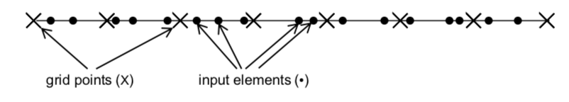
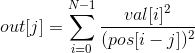

# Lab 4: Input Binning
The purpose of this lab is to understand input binning and its impact on performance in the context of a simple computation example. The example is composed of a 1-dimensional grid of discrete points and an array of elements each having a non-discrete value and a non-discrete position in the grid, as shown in the following figure.



In this example, we would like to compute the total impact of all the input elements on each of the output elements. The total impact on a single output grid point is computed as follows:



## Running code:
```
make
./binning <m> 			# Mode: m, Grid: 20,000, Input: 60,000 
./binning <m> <M> 		# Mode: m, Grid: M, Input: 3*M 
./binning <m> <M> <N> 	# Mode: m, Grid: M, Input: N
```

There are 5 modes available:

- Mode 1 executes the CPU version
- Mode 2 executes the GPU version without any cutoff or input binning
- Mode 3 executes the GPU version with cutoff but no input binning
- Mode 4 executes the GPU version with cutoff and input binning where the input binning is performed on the CPU
- Mode 5 executes the GPU version with cutoff and input binning where the input binning is performed on the GPU

